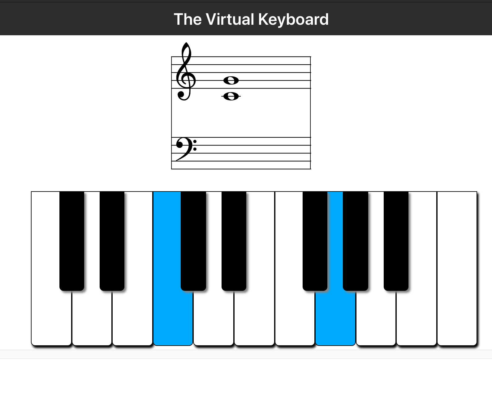

# The Virtual Keyboard

A virtual piano keyboard app, written in Typescript and React. Suitable for teaching, learning, practicing, etc...!

### Features
- Shows notes on the grand staff as you play them on the keyboard.
- Responds to keyboard and mouse input
- Responds to MIDI input in Chrome and Edge browsers
- Many settings to customize the display
    - Show/hide piano, staff, note names
    - Change the piano range
    - Make the notes sticky/sustain
    - Re-size the keyboard for small and big screens.

### Technologies used
- To display the music staff: [abcjs library](https://paulrosen.github.io/abcjs/)
- To connect to MIDI devices: [Web MIDI API](https://developer.mozilla.org/en-US/docs/Web/API/Web_MIDI_API) and [JZZ](https://github.com/jazz-soft/JZZ) library
- For React magic: uses custom hooks and useReducer for state logic (see `src/state` folder)
- For CSS magic: uses Sass, CSS variables, calc(), etc. (see `src/styles` folder)
- Settings are saved using browser's Local Storage

### In development
- Touch support and audio output!

## Acknowledgements
- Paul Rosen's amazing [abcjs library](https://paulrosen.github.io/abcjs/) for the music staff display
- The [JZZ library](https://jazz-soft.net/doc/JZZ/jzz.html) for connecting to MIDI devices
- The React team and [Create React App](https://github.com/facebook/create-react-app).
- [This video](https://www.youtube.com/watch?v=kMf1XWVY2cA) from [Suboptimal Engineer](https://github.com/SuboptimalEng) for the initial setup, code, and inspiration

## Available Scripts

In the project directory, you can run:

### `npm install`
Installs the necessary dependencies.

### `npm start`

Runs the app in the development mode.\
Open [http://localhost:3000](http://localhost:3000) to view it in the browser.

The page will reload if you make edits.\
You will also see any lint errors in the console.

### `npm run build`

Builds the app for production to the `build` folder.

