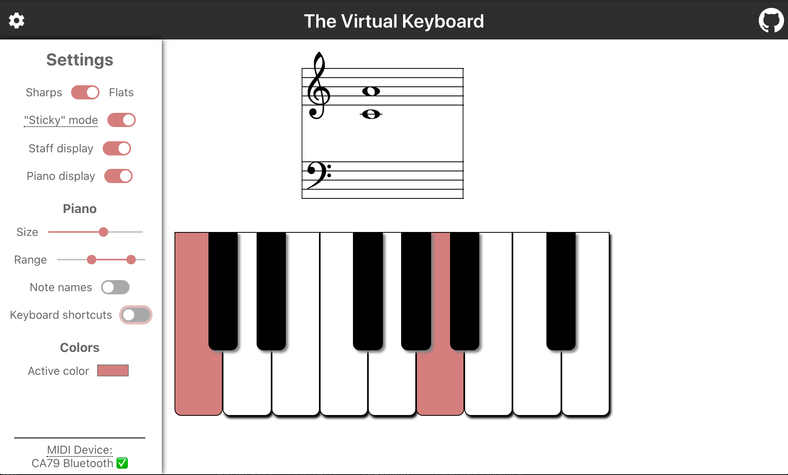

# The Virtual Keyboard

A virtual piano keyboard app that runs in the browser, written using Typescript and React. Suitable for teaching and learning!!

### Features
- Shows notes on the grand staff as you play them on the keyboard.
- Responds to keyboard and mouse input
- Responds to MIDI keyboard input in Chrome and Edge browsers, using the Web MIDI API
- Audio output (piano and synth sounds) via Tone.js
- Many settings to customize the functionality and display:
    - Show/hide piano, staff, note names, keyboard shortcuts
    - Change the piano range
    - Make the notes sticky/sustain
    - Re-size the keyboard for small and big screens.

### Libraries and features used
- To display the music staff: the amazing [abcjs library](https://paulrosen.github.io/abcjs/) by Paul Rosen
- To connect to MIDI devices: the [JZZ](https://github.com/jazz-soft/JZZ) library, which is a wrapper over the [Web MIDI API](https://developer.mozilla.org/en-US/docs/Web/API/Web_MIDI_API)
- [Tone.js](https://tonejs.github.io/) for playing audio via the Web Audio API
- Piano audio samples from the ["Little Lizard" library](https://linuxmusicians.com/viewtopic.php?t=12046)
- React bells and whistles: uses custom hooks and useReducer for state logic (see `src/state` folder)
- CSS bells and whistles: uses Sass, CSS variables, calc(), etc. (see `src/styles` folder)
- Settings are saved using browser's Local Storage

### In development
- Touch support
- Offline mode (using service workers)

## Inspirations
- [This video](https://www.youtube.com/watch?v=kMf1XWVY2cA) from [Suboptimal Engineer](https://github.com/SuboptimalEng) for the initial setup, code, and inspiration
- Examples of cool little music apps from [Chrome Music Lab](https://musiclab.chromeexperiments.com/)

## Available Scripts

In the project directory, you can run:

### `npm install`
Installs the necessary dependencies.

### `npm start`

Runs the app in the development mode.\
Open [http://localhost:3000](http://localhost:3000) to view it in the browser.

The page will reload if you make edits.\
You will also see any lint errors in the console.

### `npm run build`

Builds the app for production to the `build` folder.

